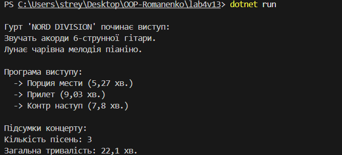

# Лабораторна робота №4: Абстракції та інтерфейси. Композиція та агрегація.

## Тема та мета роботи
**Тема:** Абстракції та інтерфейси. Композиція та агрегація.
**Мета:** навчитися створювати абстрактні класи та інтерфейси, будувати ієрархії класів, реалізовувати прості обчислення.

---
## Опис виконання завдання
В рамках роботи було створено консольний застосунок, що симулює музичний концерт.
* **Інтерфейс `Interface`**: визначає, що музичні інструменти повинні вміти грати (метод `Play`).
* **Класи `Gitara` та `Pianino`**: реалізують цей інтерфейс.
* **Агрегація**: клас `Gyrt` (гурт) використовує інструменти, але не володіє ними.
* **Композиція**: клас `Concert` володіє програмою (списком композицій), яка не може існувати без нього.
* **Обчислення**: програма рахує кількість композицій та загальну тривалість концерту.

---
## Приклад запуску

---
## Контрольні запитання

**1. У чому різниця між абстрактним класом і інтерфейсом?**
* **Інтерфейс** — це контракт, що визначає, **що** клас повинен уміти робити. Він не містить коду. Клас може реалізовувати багато інтерфейсів.
* **Абстрактний клас** — це шаблон, який може містити готову логіку. Клас може успадкувати лише один такий клас.

**2. Коли краще використовувати композицію, а коли наслідування?**
* **Наслідування** (відношення **"є"**): коли клас є різновидом іншого (`Кіт` **є** `Тварина`).
* **Композиція** (відношення **"має"**): коли клас складається з інших об'єктів (`Автомобіль` **має** `Двигун`).

**3. Як працює агрегація та чим вона відрізняється від композиції?**
Різниця у **життєвому циклі** об'єктів:
* **Композиція:** Сильний зв'язок. "Частина" не існує без "цілого" (кімната без будинку).
* **Агрегація:** Слабкий зв'язок. "Частина" може існувати самостійно (студент без ноутбука).

**4. Чи може клас реалізовувати кілька інтерфейсів одночасно?**
**Так.** Клас може реалізовувати будь-яку кількість інтерфейсів, поєднуючи різну поведінку.

**5. Для чого в ООП використовують інтерфейси як контракти?**
Інтерфейс гарантує наявність певних методів. Це дозволяє писати **гнучкий код**, який працює з будь-якими об'єктами, що дотримуються цього контракту, не залежачи від їх реалізації.